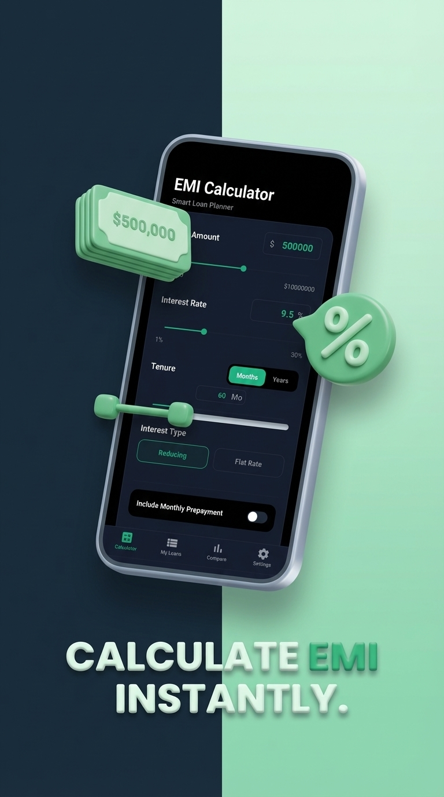

# 💰 EMI - Smart Loan Planner

**📲 Download Now on Google Play:** [EMI Calculator](https://play.google.com/store/apps/details?id=com.naim.emicalculator&pcampaignid=web_share)

**EMI - Smart Loan Planner** is a premium, feature-rich React Native application designed to help users calculate, analyze, and manage their loans with ease. Built with **Expo SDK 54**, it offers a sleek dark-themed interface, real-time visualization, and advanced financial tools.

---

## 📸 Screenshots

<p align="center">
  
  
  
  
</p>

---

## 🌟 Key Features

- **🎯 Precision Calculator**: Calculate EMI for both **Reducing Balance** and **Flat Rate** loan types.
- **📈 Interactive Visuals**: High-performance donut charts (via `react-native-svg`) to visualize Interest vs. Principal split.
- **⚡ Prepayment Analysis**: Understand how extra monthly payments can save you thousands in interest and reduce your tenure.
- **📋 Amortization Schedule**: Detailed month-by-month breakdown of principal and interest components.
- **📄 PDF Export**: Generate professional loan summaries and schedules in PDF format for sharing or printing.
- **💾 Loan Portfolio**: Save multiple loan profiles to compare and track your financial commitments.
- **🌓 Adaptive Theme**: Optimized for a premium dark mode experience with high-contrast UI elements.
- **🌍 Multi-Currency Support**: Flexible currency formatting (BDT, USD, etc.) based on user settings.

---

## 🛠️ Tech Stack

- **Core**: [React Native](https://reactnative.dev/) & [Expo SDK 54](https://expo.dev/)
- **Navigation**: [Expo Router](https://docs.expo.dev/router/introduction/) (v7)
- **UI/Animations**: [React Native Reanimated](https://docs.swmansion.com/react-native-reanimated/), [React Native Gesture Handler](https://docs.swmansion.com/react-native-gesture-handler/)
- **Charts**: [React Native SVG](https://github.com/software-mansion/react-native-svg) & [React Native Chart Kit](https://github.com/indiespirit/react-native-chart-kit)
- **Persistence**: [@react-native-async-storage/async-storage](https://react-native-async-storage.github.io/async-storage/)
- **Monetization**: [React Native Google Mobile Ads](https://docs.page/invertase/react-native-google-mobile-ads) (Optional)
- **Utilities**: `expo-print`, `expo-sharing`, `expo-haptics`

---

## 🚀 Getting Started

### Prerequisites

- [Node.js](https://nodejs.org/) (LTS)
- [Expo CLI](https://docs.expo.dev/get-started/installation/)
- Android Studio (for Emulator) or physical device with Expo Go

### Installation

1. **Clone the repository**:
   ```bash
   git clone https://github.com/ArfatChowdhury/EMI-Calculator---Smart-Loan-Planner.git
   cd emi
   ```

2. **Install dependencies**:
   ```bash
   npm install
   ```

3. **Run the app**:
   - **Android**:
     ```bash
     npx expo run:android
     ```
   - **iOS**:
     ```bash
     npx expo run:ios
     ```
   - **Expo Go (Development)**:
     ```bash
     npx expo start
     ```

---

## 📂 Project Structure

```text
├── app/                # Expo Router screens & layouts
│   ├── (tabs)/         # Bottom navigation tabs (Calculator, Compare, My Loans)
│   └── modal.tsx       # Shared modals
├── src/
│   ├── components/     # Reusable UI components (Charts, Inputs, etc.)
│   ├── hooks/          # Custom hooks for state & persistence
│   ├── utils/          # Core financial logic & PDF generation
│   └── constants/      # Theme and internationalization tokens
├── assets/             # Images, fonts, and icons
└── app.json            # Expo configuration
```

---

## 🤝 Contributing

Contributions are welcome! Please feel free to submit a Pull Request.

1. Fork the Project
2. Create your Feature Branch (`git checkout -b feature/AmazingFeature`)
3. Commit your Changes (`git commit -m 'Add some AmazingFeature'`)
4. Push to the Branch (`git push origin feature/AmazingFeature`)
5. Open a Pull Request

---

## 📄 License

Distributed under the MIT License. See `LICENSE` for more information.

---

Built with ❤️ by [Naim Uddin Arafat](https://github.com/ArfatChowdhury)
